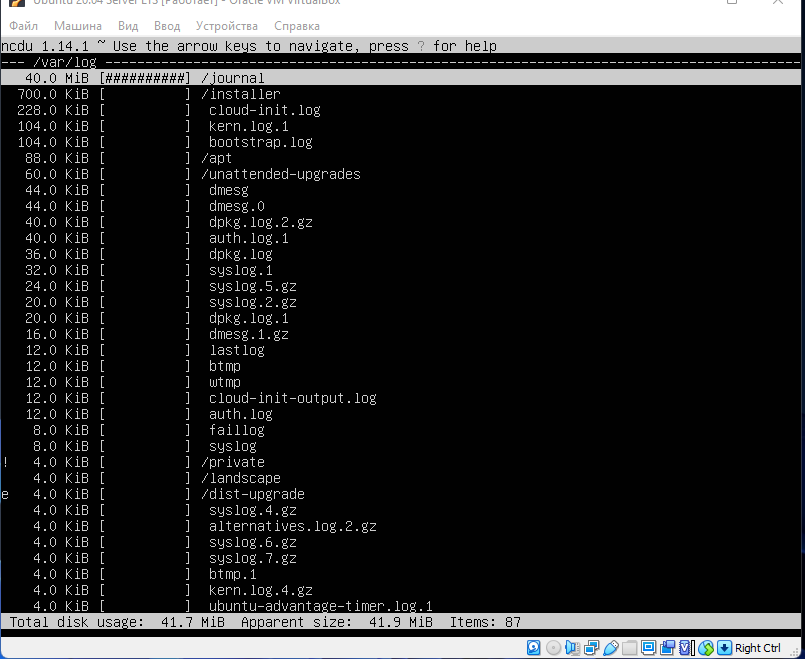

# Операционные системы UNIX/Linux (Базовый).

3.1 [Установка ОС](#part-1-установка-ос)  
 3.2 [Создание пользователя](#part-2-создание-пользователя)  
 3.3 [Настройка сети ОС](#part-3-настройка-сети-ос)  
 3.4 [Обновление ОС](#part-4-обновление-ос)  
 3.5 [Использование команды sudo](#part-5-использование-команды-sudo)  
 3.6 [Установка и настройка службы времени](#part-6-установка-и-настройка-службы-времени)  
 3.7 [Установка и использование текстовых редакторов](#part-7-установка-и-использование-текстовых-редакторов)  
 3.8 [Установка и базовая настройка сервиса SSHD](#part-8-установка-и-базовая-настройка-сервиса-sshd)  
 3.9 [Установка и использование утилит top, htop](#part-9-установка-и-использование-утилит-top-htop)  
 3.10 [Использование утилиты fdisk](#part-10-использование-утилиты-fdisk)  
 3.11 [Использование утилиты df](#part-11-использование-утилиты-df)  
 3.12 [Использование утилиты du](#part-12-использование-утилиты-du)  
 3.13 [Установка и использование утилиты ncdu](#part-13-установка-и-использование-утилиты-ncdu)  
 3.14 [Работа с системными журналами](#part-14-работа-с-системными-журналами)  
 3.15 [Использование планировщика заданий CRON](#part-15-использование-планировщика-заданий-cron)

## Part 1. Установка ОС

##### Установить **Ubuntu 20.04 Server LTS** без графического интерфейса. (Используем программу для виртуализации - VirtualBox)

- Графический интерфейс должен отсутствовать.

- Узнайте версию Ubuntu, выполнив команду \
  `cat /etc/issue.`
- Вставьте скриншот с выводом команды.

## Part 2. Создание пользователя

- Вставьте скриншот вызова команды для создания пользователя.
- Новый пользователь должен быть в выводе команды \
  `cat /etc/passwd`
- Вставьте скриншот с выводом команды.

## Part 3. Настройка сети ОС

##### Задать название машины вида user-1

##### Установить временную зону, соответствующую вашему текущему местоположению.

##### Вывести названия сетевых интерфейсов с помощью консольной команды.

- Интерфейс lo является локальной петлёй, имеющей IP-адрес 127.0.0.1. Она предназначена для обеспечения сетевого доступа к компьютеру. В принципе, этот интерфейс не требует дополнительных настроек.

##### Используя консольную команду получить ip адрес устройства, на котором вы работаете, от DHCP сервера.

- DHCP (англ. Dynamic Host Configuration Protocol — протокол динамической настройки узла) — прикладной протокол, позволяющий сетевым устройствам автоматически получать IP-адрес и другие параметры, необходимые для работы в сети TCP/IP. Данный протокол работает по модели «клиент-сервер». Для автоматической конфигурации компьютер-клиент на этапе конфигурации сетевого устройства обращается к так называемому серверу DHCP и получает от него нужные параметры. Сетевой администратор может задать диапазон адресов, распределяемых сервером среди компьютеров. Это позволяет избежать ручной настройки компьютеров сети и уменьшает количество ошибок. Протокол DHCP используется в большинстве сетей TCP/IP.

##### Определить и вывести на экран внешний ip-адрес шлюза (ip) и внутренний IP-адрес шлюза, он же ip-адрес по умолчанию (gw).

##### Задать статичные (заданные вручную, а не полученные от DHCP сервера) настройки ip, gw, dns (использовать публичный DNS серверы, например 1.1.1.1 или 8.8.8.8).

##### Перезагрузить виртуальную машину. Убедиться, что статичные сетевые настройки (ip, gw, dns) соответствуют заданным в предыдущем пункте.

- В отчёте опишите, что сделали для выполнения всех семи пунктов

1.  `hostnamectl set-hostname user-1` поставит имя хоста(машины)
2.  `timedatectl set-timezone Europe/Moscow` поставит часовой пояс
3.  `ip link` покажет все сетевые интерфейсы
4.  lo - loopback интерфейс - перенаправляет все запросы поступившие на него обратно на машину (таким образом можно стучаться себе ~~по башке~~ на 127.0.0.1 или localhost)
5.  `hostname -I` покажет ip полученый от DHCP(Dynamic Host Configuration Protocol)
6.  `ip route` покажет внутренний ip шлюза. `curl ifconfig.me` запросит внешний ip
7.  Для того чтобы поставит статический адрес необходимо редактировать .yaml файл в /etc/netplan.
    Очень важно указать шлюз правильно, иначе компьютер не сможет получить доступ к сети. Посмотреть текущий адрес шлюза можно командой: ip route show match 0/0

        Здесь мы видим, что наш адрес шлюза - 10.0.2.2. Отсюда выплывает, что нам нужно выбирать наш ip именно из этого диапазона, можно менять только последнюю цифру и надо, чтобы в этой сети компьютеров с такими адресами больше не было, например, 10.0.2.64.
        Маска подсети используется чтобы отделить локальную часть ip адреса, которая меняется, от статической. Сейчас в большинстве случаев применяется значение 255.255.255.0, которое означает изменение только последней цифры.

Прописываем свой адрес, маску(у меня 24 бита), шлюз(10.0.2.1) и DNS серверы. Потом `netplan apply и netplan try` чтобы применить изменения 8. Для ребута `reboot` и тот же `ip route` чтобы убедится в изменениях

- Успешно пропинговать удаленные хосты 1.1.1.1 и ya.ru и вставить в отчёт скрин с выводом команды.

## Part 4. Обновление ОС

## Part 5. Использование команды **sudo**

##### Разрешить пользователю, созданному в [Part 2](#part-2-создание-пользователя), выполнять команду sudo.

- _истинное_ назначение команды sudo, выполнять команды от имени администратора.
- Поменять hostname ОС от имени пользователя, созданного в пункте [Part 2](#part-2-создание-пользователя) (используя sudo).
- Вставить скрин с изменённым hostname в отчёт.
  

## Part 6. Установка и настройка службы времени

##### Настроить службу автоматической синхронизации времени.

- Вывести время, часового пояса, в котором вы сейчас находитесь.
- Вывод следующей команды должен содержать `NTPSynchronized=yes`: \
  `timedatectl show`
- Вставить скрины с корректным временем и выводом команды в отчёт.
  

## Part 7. Установка и использование текстовых редакторов

##### Установить текстовые редакторы **VIM** (+ любые два по желанию **NANO**, **MCEDIT**, **JOE** и т.д.)

##### Используя каждый из трех выбранных редакторов, создайте файл _test_X.txt_, где X -- название редактора, в котором создан файл. Напишите в нём свой никнейм, закройте файл с сохранением изменений.

- В отчёт вставьте скриншоты:
  - Из каждого редактора с содержимым файла перед закрытием.
- В отчёте укажите, что сделали для выхода с сохранением изменений.

1. `sudo apt-get install vim nano mcedit` поставит все 3 редактора

`vim test_vim.txt` автоматом создаст файл
:wq - выход с сохранением (предварительно перейти в режим команд через Esc)

`nano test_nano.txt` автоматом создаст файл
:ctrl+x - выход, y - с сохранением, enter - оставить название прежним.

`mcedit test_mcedit.txt` автоматом создаст файл
ESC - выйти, редактор спросит нужно ли сохранять файл.

##### Используя каждый из трех выбранных редакторов, откройте файл на редактирование, отредактируйте файл, заменив никнейм на строку "21 School 21", закройте файл без сохранения изменений.

- В отчёт вставьте скриншоты:
  - Из каждого редактора с содержимым файла после редактирования.
- В отчёте укажите, что сделали для выхода без сохранения изменений.

`vim test_vim.txt` откроет уже имеющийся файл
i - перейти в режим "insert" (редактирование)
:q! - выход без сохранением (предварительно перейти в режим команд через Esc)

`nano test_nano.txt` откроет уже имеющийся файл
:ctrl+x - выход, n - без сохранения, enter - оставить название прежним.

`mcedit test_mcedit.txt` откроет уже имеющийся файл
ESC - выйти, редактор спросит нужно ли сохранять файл.

##### Используя каждый из трех выбранных редакторов, отредактируйте файл ещё раз (по аналогии с предыдущим пунктом), а затем освойте функции поиска по содержимому файла (слово) и замены слова на любое другое.

- В отчёт вставьте скриншоты:
  - Из каждого редактора с результатами поиска слова.
  - Из каждого редактора с командами, введёнными для замены слова на другое.

`vim test_vim.txt` откроет уже имеющийся файл
/str - поиск совпадений str

:s/что заменить/чем заменить для замены

`nano test_nano.txt` откроет уже имеющийся файл
Ctrl+W и вводим что надо найти

Ctrl+\ и вводим что чем заменить

`mcedit test_mcedit.txt` откроет уже имеющийся файл
F7 и вводим паттерн чтобы найти то что нас интересует

F4 для и вводим что чем заменить

## Part 8. Установка и базовая настройка сервиса **SSHD**

`sudo apt install openssh-server` УСТАНОВКА OPENSSH В UBUNTU

##### Установить службу SSHd.

`sudo apt-get install sshd` установит sshd

##### Добавить автостарт службы при загрузке системы.

`systemctl enable sshd` поставит на автостарт sshd

##### Перенастроить службу SSHd на порт 2022.

`sudo vim/nano/mcedit /etc/ssh/sshd_config` чтобы редактировать конфиг и поставить ssh на порт 2022.

##### Используя команду ps, показать наличие процесса sshd. Для этого к команде нужно подобрать ключи.

- В отчёте объяснить значение команды и каждого ключа в ней.

Утилита ps для просмотра списка процессов в Linux.

-A, -e, (a) - выбрать все процессы;
-a - выбрать все процессы, кроме фоновых;
-d, (g) - выбрать все процессы, даже фоновые, кроме процессов сессий;
-N - выбрать все процессы кроме указанных;
-С - выбирать процессы по имени команды;
-G - выбрать процессы по ID группы;
-p, (p) - выбрать процессы PID;
--ppid - выбрать процессы по PID родительского процесса;
-s - выбрать процессы по ID сессии;
-t, (t) - выбрать процессы по tty;
-u, (U) - выбрать процессы пользователя.
Опции форматирования:

-с - отображать информацию планировщика;
-f - вывести максимум доступных данных, например, количество потоков;
-F - аналогично -f, только выводит ещё больше данных;
-l - длинный формат вывода;
-j, (j) - вывести процессы в стиле Jobs, минимум информации;
-M, (Z) - добавить информацию о безопасности;
-o, (o) - позволяет определить свой формат вывода;
--sort, (k) - выполнять сортировку по указанной колонке;
-L, (H)- отображать потоки процессов в колонках LWP и NLWP;
-m, (m) - вывести потоки после процесса;
-V, (V) - вывести информацию о версии;
-H - отображать дерево процессов;

##### Перезагрузить систему.

`systemctl restart sshd` для перезапуская

- Вывод команды netstat -tan должен содержать `tcp 0 0 0.0.0.0:2022 0.0.0.0:* LISTEN`
  

- В отчёте объяснить значение ключей -tan, значение каждого столбца вывода, значение 0.0.0.0.

Вывод `netstat -tan`. -t отобразит только TCP, -a покажет все сокеты -n будет показывает численные адрес. 0.0.0.0 означает в данном случае любой адрес.
Колонки:

1. Протокол
2. Счётчик байт не скопированных программой пользователя из этого сокета.
3. Счётчик байтов, не подтверждённых удалённым узлом.
4. Адрес внутренний
5. Адрес внешний
6. Состояние (слушается или нет)

## Part 9. Установка и использование утилит **top**, **htop**

`sudo apt-get install top htop` для установки утилит **top** и **htop** соответственно

##### Установить и запустить утилиты top и htop.

-Программа htop выводит следующие столбцы:

- PID - Идентификатор процесса.
- USER Имя пользователя владельца процесса или ID если имя не может быть определено.
- PRI Приоритет — внутренний приоритет ядра для процесса, обычно это просто значение nice плюс двадцать. Отличается для процессов имеющих приоритет выполнения real-time.
- NI N ICE значение процесса от 19 (низкий приоритет) до -20 (высокий приоритет). Более высокое значение означает, что -процесс «приятный» для других и позволяет им иметь более высокий приоритет выполнения.
- VIRT Размер виртуальной памяти процесса (M_SIZE).
- RES Размер резидентного набора (text + data + stack) процесса (т.е. размер используемой физической памяти процесса, M_RESIDENT).
- SHR Размер общих страниц процесса (M_SHARE).

- S - STATE, состояние процесса, может быть:

  - S для спящих (в простое)
  - R для запущенных
  - D для сна диска (бесперебойный)
  - Z для зомби (ожидает родитель считает его статус выхода)
  - T для отслеживания или приостановки (т. е. от SIGTSTP)
  - W для подкачки

- CPU% - Процент процессорного времени, которое процесс использует в данный момент.
- MEM% - Процент памяти, используемой процессом в данный момент (в зависимости от размера резидентной памяти процесса, см. M_RESIDENT выше).
- TIME+ - Время, измеренное в часах, указывает на то, сколько процесс провёл в пользовательском и системном времени.
- Command - Полная командная строка процесса (то есть имя программы и аргументы).
  

- По выводу команды top определить и написать в отчёте:
  - uptime
  - количество авторизованных пользователей
  - общую загрузку системы
  - общее количество процессов
  - загрузку cpu
  - загрузку памяти
  - pid процесса занимающего больше всего памяти
  - pid процесса, занимающего больше всего процессорного времени
  

  - uptime 13:15 | 1 user | load avg: 0.06 0.01 0.0 | 104 tasks | cpu load: 0.3% | mem load: 163.1M/976.9M | pid max mem: 1 | pid max time: 15952
  

- В отчёт вставить скрин с выводом команды htop:
  - отсортированному по PID
    
    - TOP 
  - отсортированному по PERCENT_CPU
    
    - TOP 
  - отсортированному по PERCENT_MEM
    
    - TOP 
  - отсортированному по TIME
    
    - TOP 
  - отфильтрованному для процесса sshd
    
  - с процессом syslog, найденным, используя поиск
    
  - с добавленным выводом hostname, clock и uptime
    

## Part 10. Использование утилиты **fdisk**

##### Запустить команду fdisk -l.

- В отчёте написать название жесткого диска, его размер и количество секторов, а также размер swap.

  

## Part 11. Использование утилиты **df**

##### Запустить команду df.

- В отчёте написать для корневого раздела (/):
  - размер раздела
  - размер занятого пространства
  - размер свободного пространства
  - процент использования
- Определить и написать в отчёт единицу измерения в выводе.
  в байтах.

##### Запустить команду df -Th.

- В отчёте написать для корневого раздела (/):
  - размер раздела
  - размер занятого пространства
  - размер свободного пространства
  - процент использования
- Определить и написать в отчёт тип файловой системы для раздела.
  в гигабайтах

  

## Part 12. Использование утилиты **du**

##### Запустить команду du.

##### Вывести размер папок /home, /var, /var/log (в байтах, в человекочитаемом виде)

## Part 13. Установка и использование утилиты **ncdu**

`-` Тебе, возможно, не очень понравился формат, в котором команда du выводит информацию. Я тебя прекрасно понимаю. Поэтому сейчас мы рассмотрим её улучшенную версию.

**== Задание ==**

##### Вывести размер папок /home, /var, /var/log.

Размер написан в нижней строчке

## Part 14. Работа с системными журналами

**== Задание ==**

##### Открыть для просмотра:

##### 1. /var/log/dmesg

- время последней успешной авторизации, имя пользователя и метод входа в систему.

##### 2. /var/log/syslog

##### 3. /var/log/auth.log

- Перезапустить службу SSHd.
  sudo systemctl restart service

- Вставить в отчёт скрин с сообщением о рестарте службы (искать в логах).
  

## Part 15. Использование планировщика заданий **CRON**

1. `crontab -e` для редактирования файла с задачами. При первом использовании предложит использовать редактор текста по умолчанию. Далее прописываем `*/2 * * * * * uptime` дабы записать каждые 2 минуты любого часа, любого дня, любого месяца и любого дня недели.
   
2. `crontab -r` очистит файл с задачами и оставит его пустым. Вот что получилось
   
