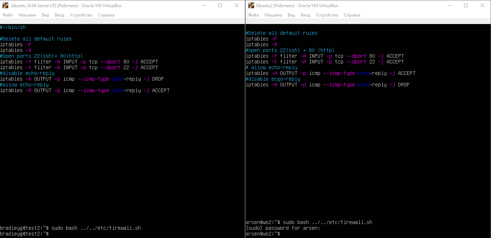

## Work

1.  [Инструмент ipcalc](#part-1-инструмент-ipcalc)
2.  [Статическая маршрутизация между двумя машинами](#part-2-статическая-маршрутизация-между-двумя-машинами)
3.  [Утилита iperf3](#part-3-утилита-iperf3)
4.  [Сетевой экран](#part-4-сетевой-экран)
5.  [Статическая маршрутизация сети](#part-5-статическая-маршрутизация-сети)
6.  [Динамическая настройка IP с помощью DHCP](#part-6-динамическая-настройка-ip-с-помощью-dhcp)
7.  [NAT](#part-7-nat)
8.  [Допополнительно. Знакомство с SSH Tunnels](#part-8-дополнительно-знакомство-с-ssh-tunnels)

## Part 1. Инструмент **ipcalc**

#### 1.1. Сети и маски

##### Определить и записать в отчёт:

##### 1) Адрес сети _192.167.38.54/13_


##### 2) Перевод маски _255.255.255.0_ в префиксную и двоичную запись, _/15_ в обычную и двоичную, _11111111.11111111.11111111.11110000_ в обычную и префиксную

      _255.255.255.0_ в префиксной == /24
      _255.255.255.0_ в двоичной == 11111111.11111111.11111111.0000

      /15 в десятичной == 255.254.0.0
      /15 в двоичной == 11111111.11111110.00000000.00000000


##### 3) Минимальный и максимальный хост в сети _12.167.38.4_ при масках: _/8_, _11111111.11111111.00000000.00000000_, _255.255.254.0_ и _/4_


#### 1.2. localhost

##### Определить и записать в отчёт, можно ли обратиться к приложению, работающему на localhost, со следующими IP: _194.34.23.100_, _127.0.0.2_, _127.1.0.1_, _128.0.0.1_

      2 и 3 это лупбэки они автоматом локалхосты

      А вот с 1 и 4 если ты владелец этих паблик\* адресов и на хосте пропишешь их как localhost в файле hosts, то тогда тоже сможешь с них же на них

      проще говоря Нет, да, да, нет.

#### 1.3. Диапазоны и сегменты сетей

##### Определить и записать в отчёт:

##### 1) какие из перечисленных IP можно использовать в качестве публичного, а какие только в качестве частных: _10.0.0.45_, _134.43.0.2_, _192.168.4.2_, _172.20.250.4_, _172.0.2.1_, _192.172.0.1_, _172.68.0.2_, _172.16.255.255_, _10.10.10.10_, _192.169.168.1_

       10.0.0.45 - private
       134.43.0.2 - public
       192.168.4.2 - private
       172.20.250.4 - private
       172.0.2.1 - public
       192.172.0.1 - public
       172.68.0.2 - public
       172.16.255.255 - private
       10.10.10.10 - private
       192.169.168.1 - public

[Proofs](../materials/ipcalc.md)

##### 2) какие из перечисленных IP адресов шлюза возможны у сети _10.10.0.0/18_: _10.0.0.1_, _10.10.0.2_, _10.10.10.10_, _10.10.100.1_, _10.10.1.255_

      /18 -> 255.255.192.0

      10.0.0.1 -
      10.10.0.2 +
      10.10.10.10 +
      10.10.100.1 -
      10.10.1.255 +

## Part 2. Статическая маршрутизация между двумя машинами

##### С помощью команды `ip a` посмотреть существующие сетевые интерфейсы


##### Описать сетевой интерфейс, соответствующий внутренней сети, на обеих машинах и задать следующие адреса и маски: ws1 - _192.168.100.10_, маска _/16_, ws2 - _172.24.116.8_, маска _/12_

      lo - это локальный интерфейс, который позволяет программам обращаться к этому компьютеруenp
      3s0 — интерфейс сети, к которой подключен кабель провайдера.


<br>

##### Выполнить команду `netplan apply` для перезапуска сервиса сети


#### 2.1. Добавление статического маршрута вручную

##### Добавить статический маршрут от одной машины до другой и обратно при помощи команды вида `ip r add`

- Для этого, мне сначала пришлось изменить yaml файлы на двух машинах
  
- конечно же `sudo netplan apply`
- на тачках должен быть включен **ipforward** это делается командой:<br>
  `sudo sysctl -w net.ipv4.ip_forward=1`
- далее <br>
  `ip a add 192.168.100.10/16 dev enp0s3`<br>
  `ip a add 172.24.116.8/12 dev enp0s3`
- затем <br>
  `ws1 -> sudo ip r a 172.240.0.0/12 via 10.0.2.13` <br>
  `ws2 -> sudo ip r a 192.168.0.0/16 via 10.0.2.12`

##### Пропинговать соединение между машинами

- В отчёт поместить скрин с вызовом и выводом использованных команд.
  

#### 2.2. Добавление статического маршрута с сохранением

##### Добавить статический маршрут от одной машины до другой с помощью файла _etc/netplan/00-installer-config.yaml_


##### Пропинговать соединение между машинами


## Part 3. Утилита **iperf3**

#### 3.1. Скорость соединения

    8 Mbps = 1 MB/s
    100 MB/s = 819 200 Kbps
    1 Gbps = 1024 Mbps

#### 3.2. Утилита **iperf3**

##### Измерить скорость соединения между ws1 и ws2

  
↑ скрины с вызовом и выводом использованных команд.

## Part 4. Сетевой экран

#### 4.1. Утилита **iptables**

##### Создать файл _/etc/firewall.sh_, имитирующий фаерволл, на ws1 и ws2:

```shell
#!/bin/sh

# Удаление всех правил в таблице "filter" (по-умолчанию).
iptables –F
iptables -X
```

##### Нужно добавить в файл подряд следующие правила:

##### 1) на ws1 применить стратегию когда в начале пишется запрещающее правило, а в конце пишется разрешающее правило (это касается пунктов 4 и 5)

##### 2) на ws2 применить стратегию когда в начале пишется разрешающее правило, а в конце пишется запрещающее правило (это касается пунктов 4 и 5)

##### 3) открыть на машинах доступ для порта 22 (ssh) и порта 80 (http)

##### 4) запретить _echo reply_ (машина не должна "пинговаться”, т.е. должна быть блокировка на OUTPUT)

##### 5) разрешить _echo reply_ (машина должна "пинговаться")

  

- скрины с содержанием файла _/etc/firewall_ для каждой машины.

##### Запустить файлы на обеих машинах командами `chmod +x /etc/firewall.sh` и `/etc/firewall.sh`

  

- скрины с запуском обоих файлов.

      разница между стратегиями, применёнными в первом и втором файлах:
      if deny rules are written first, they are NOT overwritten by allow ones

#### 4.2. Утилита **nmap**

##### Командой **ping** найти машину, которая не "пингуется", после чего утилитой **nmap** показать, что хост машины запущен

_Проверка: в выводе nmap должно быть сказано: `Host is up`_


## Part 5. Статическая маршрутизация сети

##### Поднять пять виртуальных машин (3 рабочие станции (ws11, ws21, ws22) и 2 роутера (r1, r2))

#### 5.1. Настройка адресов машин

##### Настроить конфигурации машин в _etc/netplan/00-installer-config.yaml_ согласно сети на рисунке.

- В отчёт поместить скрины с содержанием файла _etc/netplan/00-installer-config.yaml_ для каждой машины.


##### Перезапустить сервис сети. Если ошибок нет, то командой `ip -4 a` проверить, что адрес машины задан верно. Также пропинговать ws22 с ws21. Аналогично пропинговать r1 с ws11.

- В отчёт поместить скрины с вызовом и выводом использованных команд.

#### 5.2. Включение переадресации IP-адресов.

##### Для включения переадресации IP, выполните команду на роутерах:

`sysctl -w net.ipv4.ip_forward=1`
_При таком подходе переадресация не будет работать после перезагрузки системы._

- В отчёт поместить скрин с вызовом и выводом использованной команды.


  
  

##### Откройте файл _/etc/sysctl.conf_ и добавьте в него следующую строку:

`net.ipv4.ip_forward = 1`
_При использовании этого подхода, IP-переадресация включена на постоянной основе._

- В отчёт поместить скрин с содержанием изменённого файла _/etc/sysctl.conf_.


#### 5.3. Установка маршрута по-умолчанию

Пример вывода команды `ip r` после добавления шлюза:

```
default via 10.10.0.1 dev eth0
10.10.0.0/18 dev eth0 proto kernel scope link src 10.10.0.2
```

##### Настроить маршрут по-умолчанию (шлюз) для рабочих станций. Для этого добавить gateway4 \[ip роутера\] в файле конфигураций

- В отчёт поместить скрин с содержанием файла _etc/netplan/00-installer-config.yaml_.


##### Вызвать `ip r` и показать, что добавился маршрут в таблицу маршрутизации

- В отчёт поместить скрин с вызовом и выводом использованной команды.


##### Пропинговать с ws11 роутер r2 и показать на r2, что пинг доходит. Для этого использовать команду:

`tcpdump -tn -i eth1`

- В отчёт поместить скрин с вызовом и выводом использованных команд.


#### 5.4. Добавление статических маршрутов

##### Добавить в роутеры r1 и r2 статические маршруты в файле конфигураций. Пример для r1 маршрута в сетку 10.20.0.0/26:

```shell
# Добавить в конец описания сетевого интерфейса eth1:
- to: 10.20.0.0
  via: 10.100.0.12
```

- В отчёт поместить скрины с содержанием изменённого файла _etc/netplan/00-installer-config.yaml_ для каждого роутера.


##### Вызвать `ip r` и показать таблицы с маршрутами на обоих роутерах. Пример таблицы на r1:

```
10.100.0.0/16 dev eth1 proto kernel scope link src 10.100.0.11
10.20.0.0/26 via 10.100.0.12 dev eth1
10.10.0.0/18 dev eth0 proto kernel scope link src 10.10.0.1
```

- В отчёт поместить скрин с вызовом и выводом использованной команды.


##### Запустить команды на ws11:

`ip r list 10.10.0.0/[маска сети]` и `ip r list 0.0.0.0/0`

- В отчёт поместить скрин с вызовом и выводом использованных команд.
- В отчёте объяснить, почему для адреса 10.10.0.0/\[порт сети\] был выбран маршрут, отличный от 0.0.0.0/0, хотя он попадает под маршрут по-умолчанию.


    для адреса 10.10.0.0/\[порт сети\] был выбран маршрут, отличный от 0.0.0.0/0, потому, что маршрутизатьор выбирает сеть "с самой длинной маской"
    так как это более точное решение.

#### 5.5. Построение списка маршрутизаторов

Пример вывода утилиты **traceroute** после добавления шлюза:

```
1 10.10.0.1 0 ms 1 ms 0 ms
2 10.100.0.12 1 ms 0 ms 1 ms
3 10.20.0.10 12 ms 1 ms 3 ms
```

##### Запустить на r1 команду дампа:

`tcpdump -tnv -i eth0`

##### При помощи утилиты **traceroute** построить список маршрутизаторов на пути от ws11 до ws21

- В отчёт поместить скрины с вызовом и выводом использованных команд (tcpdump и traceroute).
- В отчёте, опираясь на вывод, полученный из дампа на r1, объяснить принцип работы построения пути при помощи **traceroute**.


    Утилита Traceroute вместо ICMP-запроса отправляет 3 UDP-пакета на определенный порт целевого хоста и ожидает ответа о недоступности этого порта.
    Первый пакет отправляется с TTL=1, второй с TTL=2 и так далее, пока запрос не попадёт адресату.
    Отличие от Tracert в том, как Traceroute понимает, что трассировка завершена. Так как вместо ICMP-запроса он отправляет UDP-запрос,
    в каждом запросе есть порт отправителя (Sourсe) и порт получателя (Destination). По умолчанию запрос отправляется на закрытый порт 34434.
    Когда запрос попадёт на хост назначения, этот хост отправит ответ о недоступности порта «Destination port unreachable» (порт назначения недоступен).
    Это значит, что адресат получил запрос. Traceroute воспримет этот ответ как завершение трассировки.

#### 5.6. Использование протокола **ICMP** при маршрутизации

##### Запустить на r1 перехват сетевого трафика, проходящего через eth0 с помощью команды:

`tcpdump -n -i eth0 icmp`

##### Пропинговать с ws11 несуществующий IP (например, _10.30.0.111_) с помощью команды:

`ping -c 1 10.30.0.111`

- В отчёт поместить скрин с вызовом и выводом использованных команд.


## Part 6. Динамическая настройка IP с помощью **DHCP**

##### Для r2 настроить в файле _/etc/dhcp/dhcpd.conf_ конфигурацию службы **DHCP**:

##### 1) указать адрес маршрутизатора по-умолчанию, DNS-сервер и адрес внутренней сети. Пример файла для r2:

```shell
subnet 10.100.0.0 netmask 255.255.0.0 {}

subnet 10.20.0.0 netmask 255.255.255.192
{
    range 10.20.0.2 10.20.0.50;
    option routers 10.20.0.1;
    option domain-name-servers 10.20.0.1;
}
```


##### 2) в файле _resolv.conf_ прописать `nameserver 8.8.8.8.`

- В отчёт поместить скрины с содержанием изменённых файлов.


##### Перезагрузить службу **DHCP** командой `systemctl restart isc-dhcp-server`. Машину ws21 перезагрузить при помощи `reboot` и через `ip a` показать, что она получила адрес. Также пропинговать ws22 с ws21.

- В отчёт поместить скрины с вызовом и выводом использованных команд.


##### Указать MAC адрес у ws11, для этого в _etc/netplan/00-installer-config.yaml_ надо добавить строки: `macaddress: 10:10:10:10:10:BA`, `dhcp4: true`

- В отчёт поместить скрин с содержанием изменённого файла _etc/netplan/00-installer-config.yaml_.


##### Для r1 настроить аналогично r2, но сделать выдачу адресов с жесткой привязкой к MAC-адресу (ws11). Провести аналогичные тесты


##### Запросить с ws21 обновление ip адреса

- В отчёте поместить скрины ip до и после обновления.
- В отчёте описать, какими опциями **DHCP** сервера пользовались в данном пункте.


    DHCP
    Дословно эта аббревиатура (protocol DHCP) означает Dynamic Host Configuration Protocol,
    что в переводе на русский язык означает «протокол динамической настройки узла».
    Благодаря этой технологии не требуется прописывать на каждом клиенте сетевые параметры, такие как:
    IP-адрес;
    Маска подсети;
    Основной шлюз;
    Адрес DNS-сервера.


    1) Маршрутизаторы - роутер, чувак котороый берет WAN а возвращает LAN
    2) Список ip адресов шлюза по умoлчанию - хосты LAN зависит от клвсса сети(А,В,С).
    3) Домен - name server - достаточно знать, что DNS преобразует ip адреса в понятные для нас символы, эти символы и есть домен.
    4) Список ip адресов DNS серверов - DNS сервер запоминает к каким ip вы обращались, чтобы не искать их снова

## Part 7. **NAT**

##### В файле _/etc/apache2/ports.conf_ на ws22 и r1 изменить строку `Listen 80` на `Listen 0.0.0.0:80`, то есть сделать сервер Apache2 общедоступным


- В отчёт поместить скрин с содержанием изменённого файла.


##### Запустить веб-сервер Apache командой `service apache2 start` на ws22 и r1

- В отчёт поместить скрины с вызовом и выводом использованной команды.
  

##### Добавить в фаервол, созданный по аналогии с фаерволом из Части 4, на r2 следующие правила:

##### 1) Удаление правил в таблице filter - `iptables -F`

##### 2) Удаление правил в таблице "NAT" - `iptables -F -t nat`

##### 3) Отбрасывать все маршрутизируемые пакеты - `iptables --policy FORWARD DROP`

  

##### Запускать файл также, как в Части 4

##### Проверить соединение между ws22 и r1 командой `ping`

_При запуске файла с этими правилами, ws22 не должна "пинговаться" с r1_

- В отчёт поместить скрины с вызовом и выводом использованной команды.
  <!--  -->
  

##### Добавить в файл ещё одно правило:

##### 4) Разрешить маршрутизацию всех пакетов протокола **ICMP**

##### Запускать файл также, как в Части 4

##### Проверить соединение между ws22 и r1 командой `ping`

_При запуске файла с этими правилами, ws22 должна "пинговаться" с r1_

- В отчёт поместить скрины с вызовом и выводом использованной команды.

  

##### Добавить в файл ещё два правила:

##### 5) Включить **SNAT**, а именно маскирование всех локальных ip из локальной сети, находящейся за r2 (по обозначениям из Части 5 - сеть 10.20.0.0)

_Совет: стоит подумать о маршрутизации внутренних пакетов, а также внешних пакетов с установленным соединением_

##### 6) Включить **DNAT** на 8080 порт машины r2 и добавить к веб-серверу Apache, запущенному на ws22, доступ извне сети

_Совет: стоит учесть, что при попытке подключения возникнет новое tcp-соединение, предназначенное ws22 и 80 порту_

- В отчёт поместить скрин с содержанием изменённого файла.

  

##### Запускать файл также, как в Части 4

_Перед тестированием рекомендуется отключить сетевой интерфейс **NAT** (его наличие можно проверить командой `ip a`) в VirtualBox, если он включен_

##### Проверить соединение по TCP для **SNAT**, для этого с ws22 подключиться к серверу Apache на r1 командой:

`telnet [адрес] [порт]`

##### Проверить соединение по TCP для **DNAT**, для этого с r1 подключиться к серверу Apache на ws22 командой `telnet` (обращаться по адресу r2 и порту 8080)

- В отчёт поместить скрины с вызовом и выводом использованных команд.

  

## Part 8. Дополнительно. Знакомство с **SSH Tunnels**

##### Запустить на r2 фаервол с правилами из Части 7

##### Запустить веб-сервер **Apache** на ws22 только на localhost (то есть в файле _/etc/apache2/ports.conf_ изменить строку `Listen 80` на `Listen localhost:80`)


##### Воспользоваться _Local TCP forwarding_ с ws21 до ws22, чтобы получить доступ к веб-серверу на ws22 с ws21


##### Воспользоваться _Remote TCP forwarding_ c ws11 до ws22, чтобы получить доступ к веб-серверу на ws22 с ws11

  
